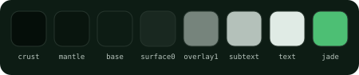
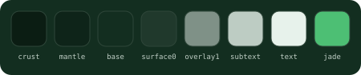
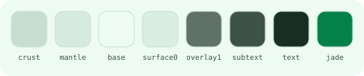
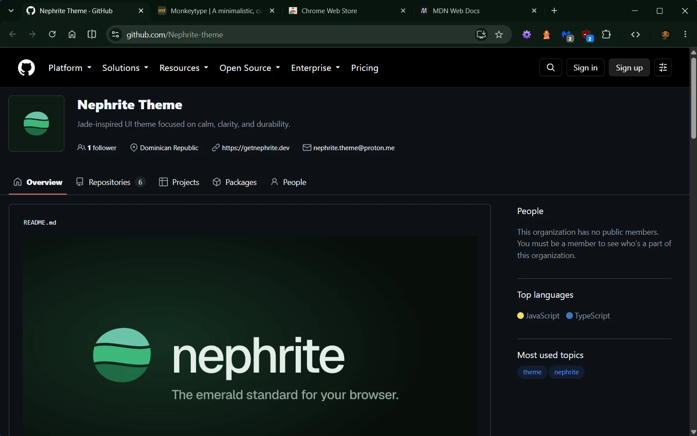
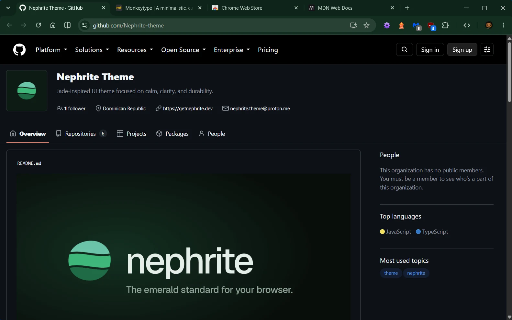
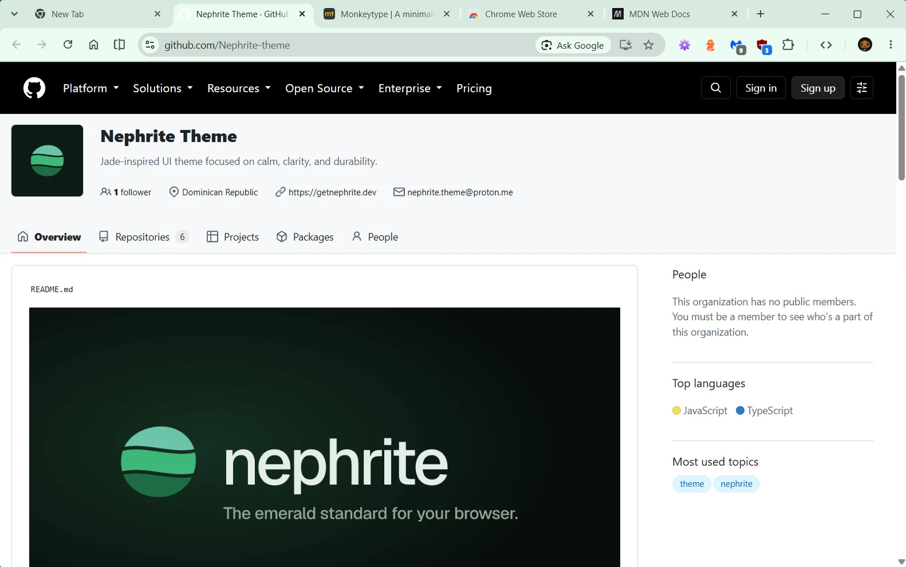
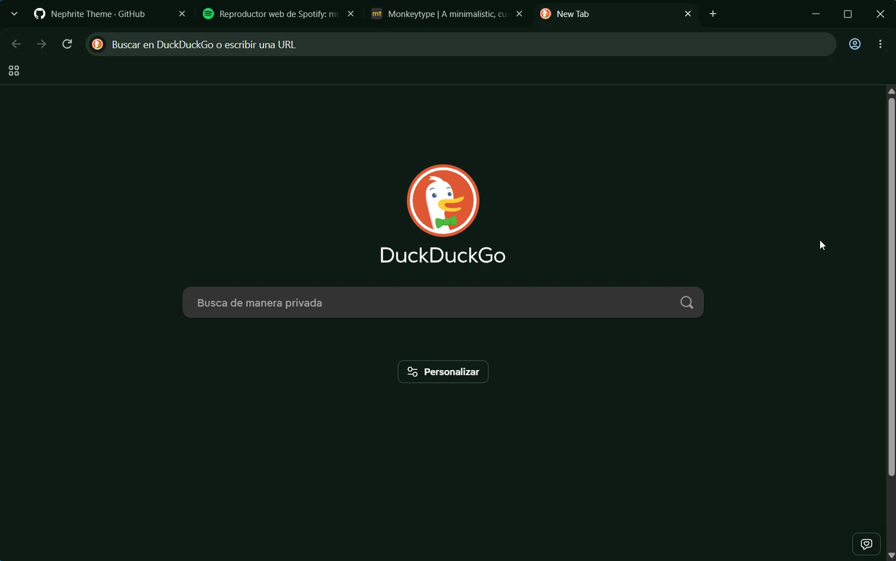
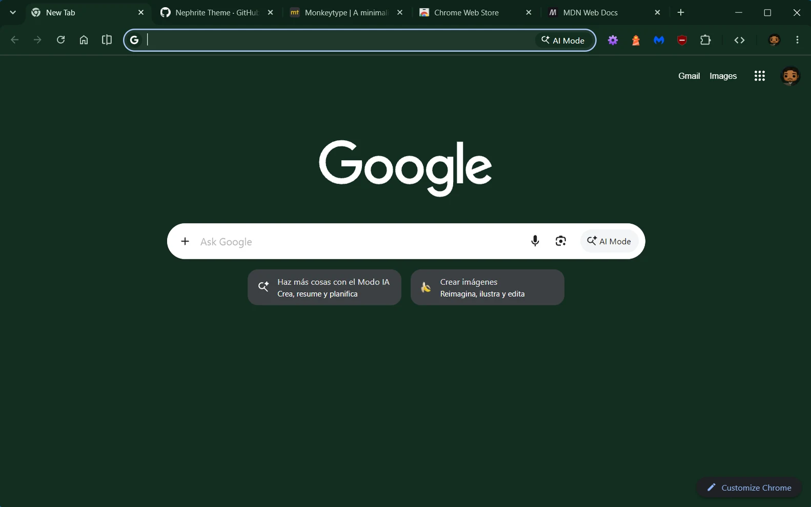
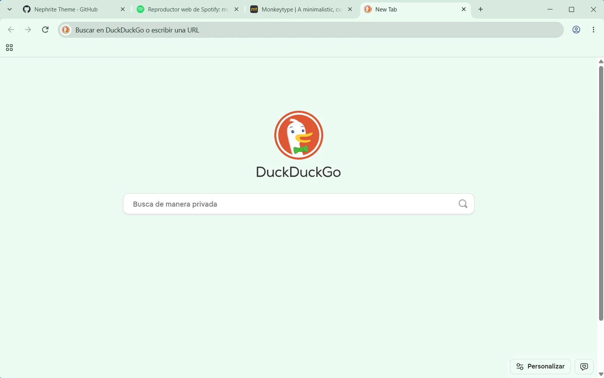

<div align="center">


# Nephrite for Chrome

**English** · [Español](README.es.md)

A calm, jade-inspired theme for [Google Chrome](https://www.google.com/chrome/), in three flavors.

[](LICENSE)
[](https://github.com/Nephrite-theme/palette)
[](https://github.com/Nephrite-theme/chrome/stargazers)

</div>

## Flavors

| Flavor | Colors used | For | Install |
| --- | --- | --- | --- |
| **Forest** |  | Deep and dark, for late nights | [Chrome Web Store](https://chromewebstore.google.com/detail/nephrite-chrome-theme-for/efhfempmenojdgamociancffkcbncffp) |
| **Jade** |  | Dark with more green, for long days | [Chrome Web Store](https://chromewebstore.google.com/detail/nephrite-chrome-theme-jad/ijmbncbgabefgapchogbdnhfgbiiimcm) |
| **Mint** |  | Light and airy, for daylight | [Chrome Web Store](https://chromewebstore.google.com/detail/nephrite-chrome-theme-min/ogfckpiocojbdmefjoogcmjmgfofijpg) |

> [!NOTE]
> Version 0.2 rebuilds every flavor from the Nephrite palette, and Jade is now a dark flavor.

## Previews

| Forest | Jade | Mint |
| --- | --- | --- |
|  |  |  |
|  |  |  |

## Install

### From the Chrome Web Store (recommended)

Open the store link for the flavor you want and click **Add to Chrome**. Installing another flavor replaces the current one.

### Manually

1. Click **Code > Download ZIP** and unzip it. Each flavor lives in its own folder under `themes/`, for example `themes/Nephrite Forest`.
2. Open `chrome://extensions` and turn on **Developer mode** (top right).
3. Click **Load unpacked** and select the flavor's folder, the one containing `manifest.json`.

To go back to the default look, open `chrome://settings/appearance` and click **Reset to default**.

## Colors

Every color comes from the [Nephrite palette](https://github.com/Nephrite-theme/palette), mapped to Chrome by role:

| Chrome surface | Palette color |
| --- | --- |
| Tab strip (frame) | `mantle`, `crust` when the window is inactive |
| Active tab, toolbar, new tab page | `base` |
| Address bar | `surface0` |
| Main text | `text` |
| Inactive tabs, bookmarks, toolbar icons | `subtext` |
| Links on the new tab page | `jade` |

## Development

The manifests in `themes/` are generated, so don't edit them by hand. To pick up palette changes:

```sh
node scripts/sync-palette.mjs   # download the latest palette.json
node scripts/build.mjs          # regenerate the three manifests
```

To publish an update, bump `VERSION` in `scripts/build.mjs`, rebuild, and upload each flavor folder as a ZIP to its Chrome Web Store listing. Node 18 or newer, no dependencies.

## Contributing

Found a color that clashes or low contrast? [Open an issue](https://github.com/Nephrite-theme/chrome/issues/new/choose) with a screenshot. For how Nephrite ports are built and reviewed, see the [contributing guide](https://github.com/Nephrite-theme/.github/blob/main/CONTRIBUTING.md).

## Thanks

Created and maintained by [@ingfranciscastillo](https://github.com/ingfranciscastillo). Contributors will be listed here as the community grows.

## More Nephrite

Nephrite is coming to Firefox, VS Code and more. See every app at [getnephrite.dev/ports](https://getnephrite.dev/ports).
