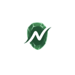

<div align="center">



### Nephrite for [Chrome](https://www.google.com/chrome/)

A calm, mineral-inspired collection of Google Chrome themes built around balance,
focus, and natural color harmony.

<br />


</div>

## 🌿 About Nephrite

**Nephrite** is a community-driven color system inspired by natural minerals and stones.  
Its goal is to create visually calm, consistent themes that can be reused across tools,
apps, and platforms.

This repository contains the official **Nephrite themes for Google Chrome**.

## 🎨 Previews

<details>
<summary><strong>Forest</strong></summary>

<br />


</details>

<details>
<summary><strong>Jade</strong></summary>

<br />


</details>

<details>
<summary><strong>Mint</strong></summary>

<br />


</details>

## 🚀 How to use

### 👉 Option 1 — Install from Google Chrome Web Store (recommended)

Install the themes directly from the Chrome Web Store:

🌳 [Forest](https://chromewebstore.google.com/detail/nephrite-chrome-theme-for/efhfempmenojdgamociancffkcbncffp)

💚 [Jade](https://chromewebstore.google.com/detail/nephrite-chrome-theme-jad/ijmbncbgabefgapchogbdnhfgbiiimcm)

🌿 [Mint](https://chromewebstore.google.com/detail/nephrite-chrome-theme-min/ogfckpiocojbdmefjoogcmjmgfofijpg)

Chrome will apply the selected theme automatically after installation.

### 👉 Option 2 — Manual installation:

If you want to install a theme manually:

#### 1️⃣ Download the repository

Click **Code > Download ZIP** and unzip it. Each flavor lives in its own folder under `themes/` (for example `themes/Nephrite Forest`).

#### 2️⃣ Open Chrome Extensions

Go to:
chrome://extensions

#### 3️⃣ Enable Developer Mode

Toggle **Developer mode** (top right corner).

#### 4️⃣ Load the theme

Click **Load unpacked** and select the flavor's folder, the one containing `manifest.json`.

The theme will be applied immediately.

## 🎨 Colors

Every color comes from the [Nephrite palette](https://github.com/Nephrite-theme/palette), mapped to Chrome by role:

| Chrome surface | Palette color |
| --- | --- |
| Tab strip (frame) | `mantle`, `crust` when the window is inactive |
| Active tab, toolbar, new tab page | `base` |
| Address bar | `surface0` |
| Main text | `text` |
| Inactive tabs, bookmarks, toolbar icons | `subtext` |
| Links on the new tab page | `jade` |

The manifests in `themes/` are generated, so don't edit them by hand. To pick up palette changes:

```sh
node scripts/sync-palette.mjs   # download the latest palette.json
node scripts/build.mjs          # regenerate the three manifests
```

To publish an update, bump `VERSION` in `scripts/build.mjs`, rebuild, and upload each flavor folder as a ZIP to the Chrome Web Store.

## 🤝 Contributing

Nephrite is meant to be **community-driven** 🌱

You can help by:

- Improving color balance
- Creating new theme variants (Mint, Forest, etc.)
- Adding support for other platforms
- Improving documentation

Feel free to open:

- Issues
- Pull Requests
- Discussions

## 💚 Thanks

This project currently exists thanks to:

- **Francis** — creator, maintainer, and contributor

More contributors will be added here as the community grows ✨

## 📄 License

This project is open-source and available under the **MIT License**.

You are free to use, modify, and share it.

<div align="center">

🌿 **Nephrite — colors inspired by nature, built by community** 🌿

</div>
